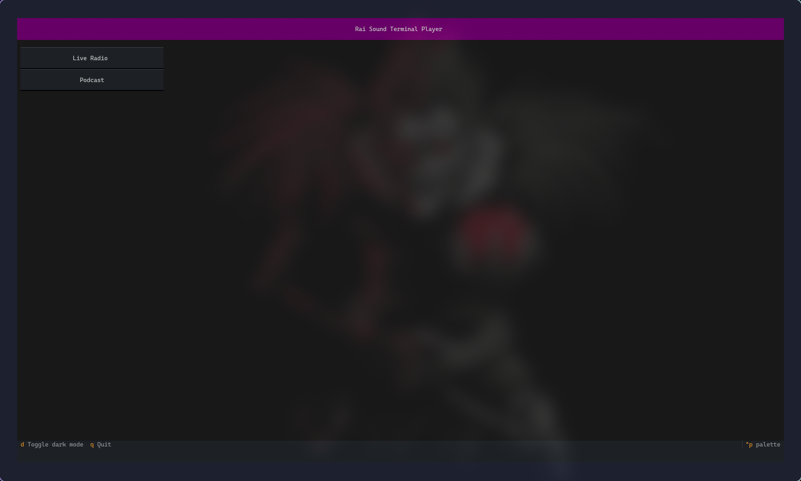
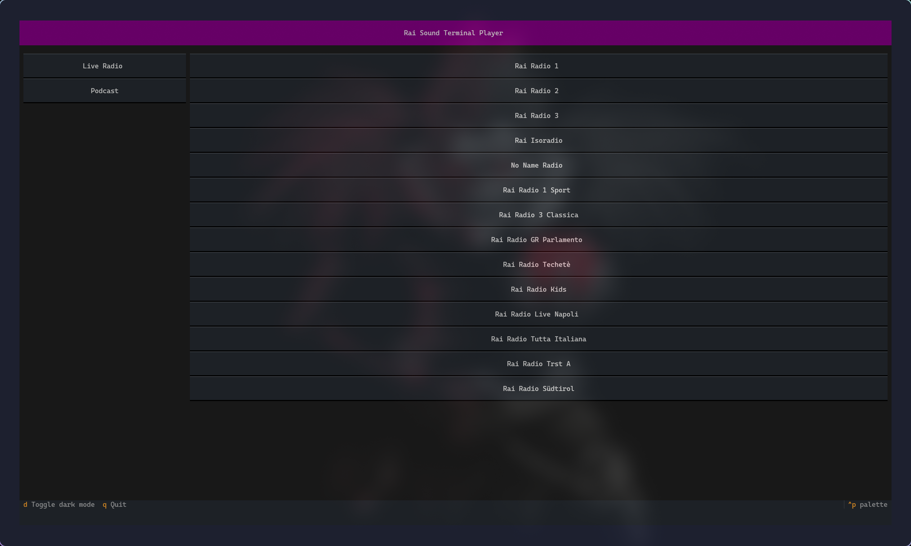
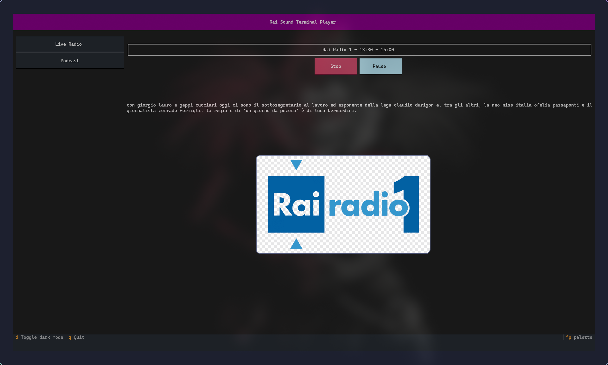
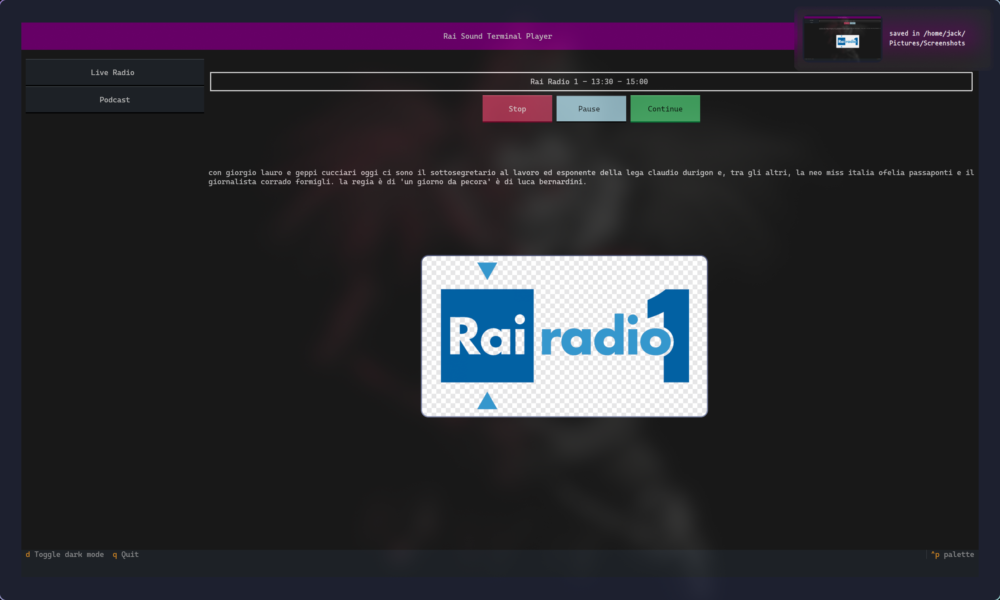

# Rai Play Sound player

This is a very simple Terminal application which will allow you to listen to several diffrent Radio Station. The original state is configured with Rai Radio station (those are Italian's radio stations.)

 
 
